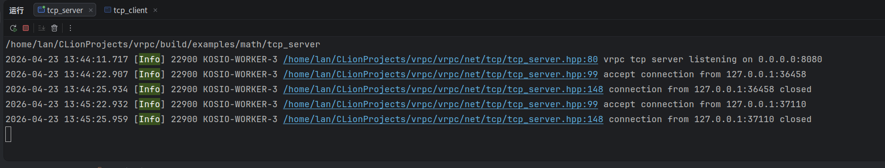
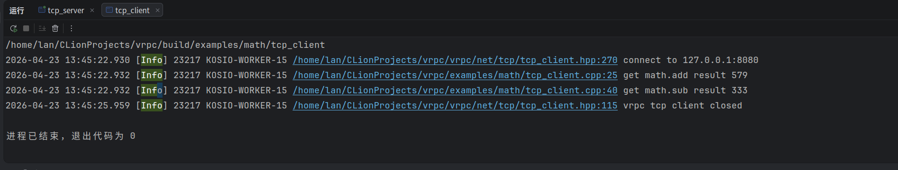
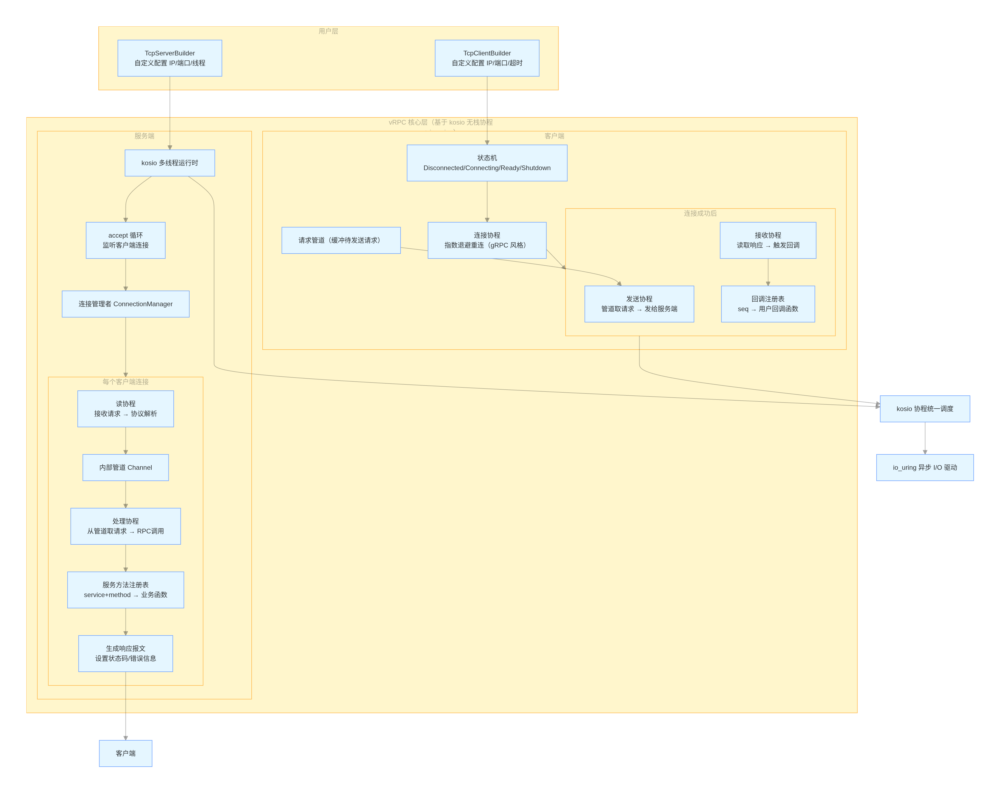

[TOC]

 

## 1.简介

### 1.1.vRPC特点

**vRPC** 是一个基于 **io_uring** 和 **c++无栈协程** ([kosio](https://github.com/LAN40-Git/kosio)) 实现的轻量 RPC 通信框架，内置避让策略、连接管理、重试机制等模块，通过回调机制让客户端发送的请求能够被并行处理，服务端内置连接管理池，为每个客户端连接维护一个全双工的通信流，并行处理客户端的请求。

客户端提供的调用方法 **call_method** 是异步非阻塞的，既不会阻塞线程，也不会阻塞协程，这意味着 **vrpc** 的 RPC 调用是非常高效的

### 1.2.协议报文支持

**vRPC**目前只支持内置的协议报文，并正在准备支持 **HTTP** 报文

## 2.性能测试

将在支持 **HTTP** 协议后使用 wrk 进行测试...

## 3.安装 vRPC

### 3.1.cmake

#### 3.1.1.安装

```shell
sudo apt update
# 安装依赖
sudo apt install -y build-essential git cmake pkg-config liburing-dev protobuf-compiler libprotobuf-dev

# 安装 kosio
git clone git@github.com:LAN40-Git/kosio.git
cd kosio
mkdir build && cd build
cmake ..
make -j$(nproc)
# 默认安装路径是 /usr/loacl/include/kosio
sudo make install

# 安装 vrpc
git clone git@github.com:LAN40-Git/vrpc.git
cd vrpc
mkdir build && cd build
cmake ..
make -j$(nproc)
# 默认安装路径是 /usr/loacl/include/vrpc
sudo make install
```

#### 3.1.2.卸载

```shell
sudo make uninstall
```

## 4.快速使用

### 4.1.搭建一个基于内置协议的 RPC 服务

#### 4.1.1.准备 protobuf 文件

这是一个简单的数学加减法RPC服务，我们定义 protobuf 文件如下，包含加减法的请求和回复

```protobuf
syntax = "proto3";

message MathAddReqeust {
  int64 augend = 1;
  int64 addend = 2;
}

message MathAddResponse {
  int64 result = 1;
}

message MathSubReqeust {
  int64 minuend = 1;
  int64 subtrahend = 2;
}

message MathSubResponse {
  int64 result = 1;
}
```

`vrpc`并不支持`grpc`的反射机制，因此不需要定义 service

#### 4.1.2.编写业务代码并启动/请求 RPC 服务

```c++
// an simple rpc tcp server
// ctrl + c to close
#include <kosio/signal/signal.hpp>
#include "../api/mathpb/math.pb.h"
#include "vrpc/net/builder.hpp"

auto add(const MathAddRequest& request) -> kosio::async::Task<MathAddResponse> {
    auto augend = request.augend();
    auto addend = request.addend();
    MathAddResponse response;
    response.set_result(augend + addend);
    co_return response;
}

auto sub(const MathSubRequest& request) -> kosio::async::Task<MathSubResponse> {
    auto minuend = request.minuend();
    auto subtrahend = request.subtrahend();
    MathSubResponse response;
    response.set_result(minuend - subtrahend);
    co_return response;
}

auto main() -> int {
    vrpc::TcpServerBuilder::options()
        .set_ip("0.0.0.0")
        .set_port(8080)
        .set_thread_nums(4)
        .build()
        .register_method<MathAddRequest, MathAddResponse>("math", "add", add)
        .register_method<MathSubRequest, MathSubResponse>("math", "sub", sub)
        .wait();
}
```

我们在服务端定义了两个方法，`add`和`sub`，`vrpc`框架保证方法中的请求引用是有效的，使用`vrpc::TcpServerBuilder`来构建服务端，可以自定义选项，`wait`方法会阻塞并持续提供RPC服务。

```c++
// an simple rpc tcp client
// ctrl + c to close
#include <kosio/signal/signal.hpp>
#include "../api/mathpb/math.pb.h"
#include "vrpc/net/builder.hpp"

auto main_coro() -> kosio::async::Task<void> {
    auto rpc_client = vrpc::TcpClientBuilder::options()
        .set_ip("127.0.0.1")
        .set_port(8080)
        .build();

    // 模拟 RPC 调用
    MathAddRequest add_request;
    add_request.set_augend(123);
    add_request.set_addend(456);
    co_await rpc_client.call_method<MathAddRequest, MathAddResponse>(
        "math", "add", add_request,
        [](const vrpc::Status& status, const MathAddResponse& response) -> kosio::async::Task<void> {
            if (!status.ok()) {
                LOG_ERROR("{}", status.message());
                co_return;
            }

            LOG_INFO("get math.add result {}", response.result());
            co_return;
        });

    MathSubRequest sub_request;
    sub_request.set_minuend(456);
    sub_request.set_subtrahend(123);
    co_await rpc_client.call_method<MathSubRequest, MathSubResponse>(
        "math", "sub", sub_request,
        [](const vrpc::Status& status, const MathSubResponse& response) -> kosio::async::Task<void> {
            if (!status.ok()) {
                LOG_ERROR("{}", status.message());
                co_return;
            }

            LOG_INFO("get math.sub result {}", response.result());
            co_return;
        });
    co_await kosio::time::sleep(3000);

    // 优雅关闭
    co_await rpc_client.shutdown();
}

auto main() -> int {
    kosio::runtime::MultiThreadBuilder::default_create().block_on(main_coro());
}
```

客户端中直接使用`call_method`进行RPC调用，在回调函数中，会拿到一个`vrpc::Status`，这个状态中有RPC调用状态和错误信息，可以通过`ok()`方法判断是否有RPC调用错误，并通过`message()`获取错误信息。

#### 4.1.3.测试结果

我们直接启动服务端进程和客户端进程，可以看到如下结果

服务端



客户端



### 4.2.搭建一个基于 HTTP 协议的 RPC 服务

开发中...

## 5.设计

### 5.1.协议报文设计

#### 5.1.1.内置协议报文设计

**请求报文**

```c
uint64_t    seq_{};                // 报文序号，回复与请求通用
uint32_t    service_name_size_{0}; // 服务名大小
std::string service_name_;         // 服务名
uint32_t    method_name_size_{0};  // 方法名大小
std::string method_name_;          // 方法名
uint32_t    payload_size_{0};      // protobuf 消息大小
std::string payload_;              // protobuf 消息
uint32_t    check_sum_{0};         // 校验和
static constexpr uint32_t MIN_MESSAGE_SIZE = sizeof(seq_) + sizeof(service_name_size_) + sizeof(method_name_size_) + sizeof(payload_size_) + sizeof(check_sum_);
```

**回复报文**

```c
uint64_t    seq_{};           // 报文序号，回复与请求通用
uint8_t     status_code_{0};  // RPC 状态码
uint32_t    err_msg_size_{0}; // 错误消息长度
std::string err_msg_;         // 错误消息（状态码非 0 时设置）
uint32_t    payload_size_{0}; // protobuf 消息大小
std::string payload_;         // protobuf 消息
uint32_t    check_sum_{0};    // 校验和
static constexpr uint32_t MIN_MESSAGE_SIZE = sizeof(seq_) + sizeof(status_code_)+ sizeof(err_msg_size_) + sizeof(payload_size_) + sizeof(check_sum_);
```

特别说明：

- 回复报文中的`status_code_`具体表现为客户端回调中拿到的`vrpc::Status`，具体有以下几种状态

  ```c
  enum Code : uint8_t {
      kOk = 0,
      kAborted,
      kAlreadyExists,
      kCancelled,
      kNotFound,
      kInvalidArgument,
      kDeadlineExceeded,
      kPermissionDenied,
      kUnavailable,
      kInternal,
      kResourceExhausted,
      kUnknown
  };
  ```

  可以通过`code()`获取对应状态码，通过`message()`获取错误信息（当状态码非0时会被设置）

### 5.2.整体框架图（AI 生成）

**整体框架图**



**服务端流程图**


**客户端流程图**


## 6.正在完善...
